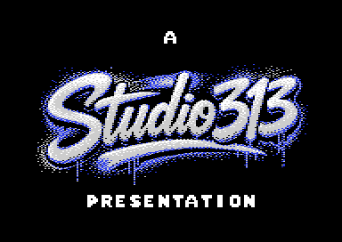
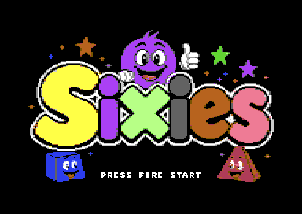
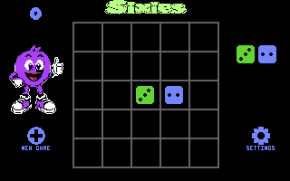
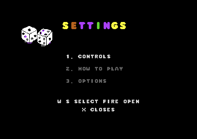
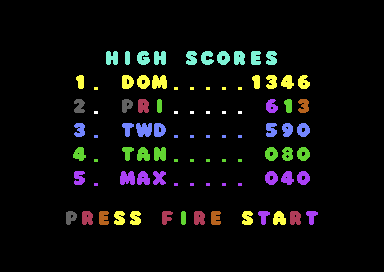
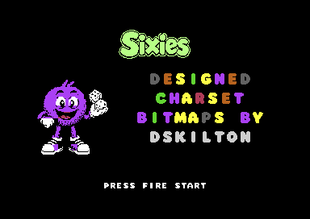
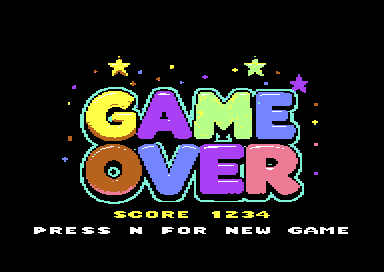

# Dice Merge for Commodore 64

A 5x5 hi-res puzzle game written in 6510 assembly for ACME. Place random single or double dice, merge connected matching values, and keep space available on the board.

## Screenshots

| Presentation | Title |
| --- | --- |
|  |  |

| Gameplay | Settings |
| --- | --- |
|  |  |

| High scores | Credits |
| --- | --- |
|  |  |



Exact platform-neutral behavior is specified in `docs/game-rules.md`, with
the enumerated spawn distribution in `docs/piece-probabilities.md`, and is
exercised by `tests/porting/gameplay-vectors.json`. Game Boy milestones and
technical decisions are in `docs/porting-gameboy.md`; repository architecture
and agent invariants are in `AGENTS.md`. Reproducible defects and their fix
history are maintained in `docs/bug-tracker.md`.

The main grid screen follows the Atari 800 composition: a compact light-green
version of the supplied green Sixies wordmark is centered above the lowered 5x5 board. The four-digit
score and purple-and-white mascot occupy the left sidebar, the upcoming single
or double dice preview remains in the right sidebar, and merge exclamations
appear beneath it without covering the board. The New Game and Settings
controls sit at the bottom of the left and right side panels.

The Sixies font is reproduced from the supplied 1536x1024 reference sheet during the build, at two sizes. Every glyph on the sheet is a flat colored body inside a white outline, so only the body is sampled; the outline is discarded because it anti-aliases through the same gray that fills `D`, `J`, `P`, `V`, `2` and `8`, and would otherwise fatten every letter by a pixel. Each alphabet row contributes its own cap line and baseline, so the whole set shares one vertical rhythm.

`SixiesFont16.bin` is the faithful cut: 36 glyphs at 16x16, each a 2x2 block of characters, keeping the rounded bowls, the heavy stems and the tiny counters. Area coverage alone closes the counters of `A`, `B`, `D`, `P`, `R`, `4`, `6`, `8` and `9`, so every enclosed region in the source is reopened after thresholding. `Q` keeps its tail; the round glyphs that clear the baseline by a single source pixel are trimmed back so they do not eat the line gap. The credits cards and the score digits use this cut.

`SixiesFont_charset.bin` is the body-text cut: the same alphabet at 8x8 in a 2048-byte ASCII-indexed charset, used by the `GAME OVER` banner and the high-score page. Seven rows of cap height cannot hold the blobby `M` and `W` middles, the curled `C` and `G` terminals or the `K` arms without collapsing them into slabs that read as the wrong letter, so fifteen glyphs are hand drawn in `OVERRIDES_8X8`; the rest are resampled. `make` regenerates both cuts, their previews, and the derived banner and score tables.

The game opens with a native C64 multicolor title screen using flat-color Sixies branding and solid outlines. While waiting, it rotates through the title, high-score, and credits pages every five seconds. The credits keep a light-green Sixies logo and dice mascot fixed while design/charset/bitmap, music, and Studio 313 Games copyright cards fade in and out in sequence. Press `Space`, `Return`, or joystick fire from any attract screen to enter the hi-res game board.

The lower-left corner of the opening Studio 313 presentation screen shows
`V1.xxx`. The `1` identifies
the first public release series. Each normal, crunched,
or run build advances this three-digit revision automatically. The persistent
workspace counter is stored in gitignored `.context/build-revision.txt`, while
the exact revision embedded in the newest PRG is written to
`build/build-version.txt`.

## Build and run

```sh
make
make run
make crunch
make probability-table
make setup-porting
make gimp
```

The normal build creates `build/dice_merge.prg`. `make crunch` also creates the self-extracting release file `build/dice_merge-crunched.prg` using the installed Exomizer 3.1.2 binary. ACME is installed locally under `.tools/` when needed.

`make probability-table` regenerates `docs/piece-probabilities.md` from the
portable spawn oracle. The table records the exact correlated outcomes of the
implemented LFSR rather than assuming independent face rolls.

`make setup-porting` bootstraps a newly created branch or Conductor workspace.
It verifies the specifications, tests, screenshots, and source masters; runs
the gameplay vectors; and writes discoverable local paths to the gitignored
`.context/porting-paths.env` file.

`make run` maps the first SDL controller (`JOYDEV2=4`) to C64 joystick port 2.
Use `make run JOYDEV2=5` for the second detected controller. VICE reports
`SDLJoystick: No joysticks found` when macOS has not exposed the controller;
reconnect it before launching VICE in that case.

`make crunch` uses `exomizer` from `PATH` when available. Set `EXOMIZER=/path/to/exomizer` to use a specific binary; the bundled Albert path remains a fallback for this development machine.

## Development toolchain

- ACME assembles the 6510 source with strict segment checks.
- GNU Make coordinates builds and generated assets.
- Python 3 contains the deterministic artwork, table, and packaging tools.
- FFmpeg decodes source images and writes generated previews.
- Exomizer 3.1.2 creates the self-extracting release PRG.
- VICE (`x64sc`) runs and verifies the C64 build.
- c64SIDkit authors and exports SID sound effects.
- GIMP 3 is the supported editor for PNG/JPG source masters.

Open GIMP from the repository with `make gimp`, or open a particular source
master with, for example:

```sh
make gimp GIMP_ASSET=src/assets/chain_reaction_master.png
```

GIMP is an authoring tool rather than a build dependency. Save intentional
artwork changes to the relevant `*_master.*` file, then run its Make target so
the repository converters regenerate the C64 binary data and preview.

## Memory map

The assembler is run with `--strict-segments`; these fixed regions must not overlap:

| Range | Purpose |
| --- | --- |
| `$0801-$1c7f` | BASIC launcher and game code |
| `$1c80-$2fff` | Packed title image and tables |
| `$3000-$43ff` | Packed merge callouts, gameplay effect helpers, and compact logo data |
| `$4400-$47e7` | VIC-II screen RAM |
| `$6000-$7f3f` | Visible VIC-II bitmap RAM |
| `$7f40-$7fff` | Preview-sprite builder in the bitmap bank's unused tail |
| `$8000-$9fff` | Gameplay effects and UI code |
| `$a000-$cfff` | SID music, credits, presentation, settings art, and asset data |

The startup title and high-score attract screens play `Eternity #1 (intro)` by Przemyslaw Lewandowski (Sonix), 1995 Undying/Sun Designs. A dedicated raster IRQ keeps playback continuous while title and high-score graphics are copied, and the gameplay IRQ continues calling the same tune at 50 Hz on PAL and NTSC machines. The music player is software-shadowed before its register state is published to the SID. Gameplay effects can therefore borrow voice 1 while voices 2-3 continue, and the tune restores the complete voice-1 state as soon as each effect ends. The SID player is relocated to RAM at `$A000`.

## Sound design

c64SIDkit is installed locally under `.tools/c64SIDkit` for SID sound-effect authoring. Restore the installation or open its graphical tweaker with:

```sh
make setup-sidkit
make sidkit
```

The command-line exporter is available at `.tools/c64SIDkit/.venv/bin/sid-sfx`.

Settings > Options includes independent `MUSIC: ON/OFF` and
`SOUND FX: ON/OFF` toggles. Music starts off by default and begins from the
start of the tune when the player enables it; sound effects start enabled.

## Controls

- `W`, `A`, `S`, `D` or joystick port 2: move the current piece
- `Q`: rotate a double piece counterclockwise
- `E`: rotate a double piece clockwise
- Hold joystick fire and press Left/Right: rotate a double counterclockwise/clockwise
- `Space` or `Return`: place the piece
- Joystick fire: place the piece when the button is released without rotating
- `N`: clear the board and start a new game
- `Space` or `N` on a high-score page: start a new game
- `O`: open the Settings menu
- `N` while Settings is open: show the next instructions page
- From the grid's bottom row, press Down to focus New Game from columns 0-2 or Instructions from columns 3-4. Press Fire/Space to select, Up to return to the grid, or Left/Right to switch options. Instructions opens the Settings pages.
- `.`: development shortcut that randomly fills the board and triggers Game Over

Moving a die between grid cells plays the three-frame c64SIDkit `bounce` effect. Successful placement and double-die rotation play the higher-priority five-frame `portal_ping` effect through SID voice 1. The new-game grid ripple uses a randomized sawtooth effect reconstructed from the Sound FX Kit `TEST11` controls and stops when the setup animation finishes. Trying to place a die outside the board or over an occupied cell plays a custom low triangle "bonk" with a rapid downward pitch sweep.

## Rules

Each turn normally produces one or two dice with values from 1 to 4. Once at least five value-5 dice are present on the board, eligible spawned singles have a low chance of becoming a generated value-5 die. A double piece can never contain two value-4 dice. Double pieces rotate in four directions and must fit entirely inside empty grid cells. See `docs/game-rules.md` for the exact RNG call order and probability behavior.

Valid targets use blinking inverse-color preview dice, with one preview per die. Targets that overlap an occupied cell show the intended dice as gray dithered shadows and cannot be placed.

Three or more edge-connected equal dice merge at the placed die. Values progress from 1 through 6; a connected group of 6s disappears. New values can immediately trigger another merge. Each placement's first merge scores the total face value consumed, its second merge scores that value at 2x, its third at 3x, and so on.
When another merge is waiting in the chain, the supplied comic-burst artwork
appears as a white, 72-by-40-pixel, three-sprite `CHAIN REACTION!` banner.
It uses the existing inter-merge pause and overlays the gameplay mascot in the
left side panel without changing gameplay timing.

The first merge in every chain plays a happy rising C-E-G-C pulse arpeggio synchronized with the start of the merge animation. Cascading merges do not replay the first-merge cue.

When a score enters the top five, its complete high-score row flashes yellow and white until the player enters all three initials.

When no two edge-adjacent empty cells remain, the game switches permanently to single-die pieces. Filling the final empty cell ends the game.

The uncommitted dice under the cursor blink between filled and inverse-color silhouettes. Doubles change together, while placed dice stay solid.

Placed dice pulse to acknowledge the move. Each merge fades in one of the supplied hi-res comic bursts beneath the upcoming dice in the right sidebar. Lower-value merges rotate through `AWESOME`, `BOOM`, `DANG`, `LETS GO`, `WHOA`, `WOW`, `YEAH`, and `YES`; merging value-5 dice always shows `FIVES`, and merging value-6 dice always shows `SIXIES`. The bursts are resized and centered in a 72-by-64-pixel panel that does not touch the board border or the bottom Settings control. A value-1 merge keeps its word solid white. Value 2 begins entirely blue and changes to gray from left to right, while value 3 sends a green band from left to right across white. Value-4, value-5, and value-6 merges animate concentric red, orange, yellow, green, cyan, blue, and purple bands through the word. On a merge, full squares along the destination row and column flash inward from all four grid edges while the dice pulse: white for the first merge and cyan for a chain merge. Three sprite stars burst from the destination, jump outward, and fall in separate arcs into the next grid row. A second chain merge doubles the size of the firework stars. Creating a six follows the burst with three stars descending from the top to the bottom of the board. The upgraded die pauses for roughly half a second before a second chain merge collapses. New Game spirals from the bottom-left cell toward the center. Game over reverses that effect, then wipes the full display from top to bottom with a solid gray band. Each band holds for 0.1 seconds before revealing the supplied multicolor `GAME OVER` Koala artwork. The completed logo, four-digit score, and `PRESS N FOR NEW GAME` prompt remain visible for five seconds before the five-entry high-score page replaces the center panel. A new first-place score prompts for three initials and persists until the PRG is reloaded. The end-game display then rotates through the title, high-score, and credits pages every ten seconds. A compact `PRESS N FOR NEW GAME` instruction remains at the bottom; `N` starts from any end-game page, while either `Space` or `N` starts from a high-score page. New Game restores hi-res mode and resets the board, score, and single-die endgame mode without clearing the high-score table.
