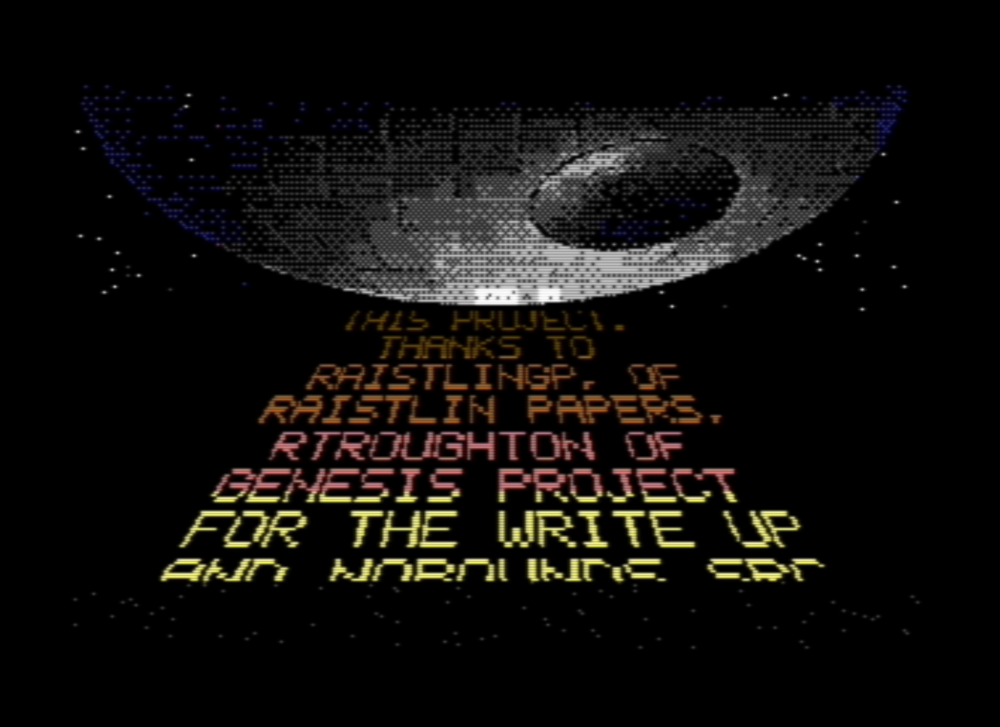

# Starwars Demo

Standalone C64 Starwars Demo scroller intro inspired by Raistlin's write-up and
the Nobounds / Genesis Project Starwars part.

The primary `build/StarwarsScrollerDemo.prg` target is a native ACME port of the
technique from the NoBounds Starwars part (`Starwars.cpp` in the public
release): a hires-bitmap crawl with real pixel-level perspective.
`scripts/generate_tables.py` builds a 16x16 font from a small set of unique
16px row segments, precomputes bit-picked FontData tables for every
(screen line, byte, source column) the perspective mapping needs, and emits a
fully unrolled plotter. At runtime the scrolltext streams through 16 cyclic
256-byte column buffers as font-row indices; the plotter samples them with
`ldy ScrollData+col,x / lda FontData_a,y / and FontData_b,y / sta bitmap`,
skipping more source rows per screen line near the horizon. Background is
1-bits and ink is 0-bits, so overlapping glyph halves combine with `AND`.
The intro plays the "Galway Nights" soundtrack (see below) from a raster
interrupt so the tune keeps 50 Hz timing while the plotter runs longer than
a frame. `scripts/generate_logo.py` converts `src/assets/deathstar_logo.png`
into hires bitmap data that is AND-merged over the starfield in the 80-pixel
banner area above the crawl, with per-cell C64 ink colours chosen from the
source image. The native PRG now also runs a short `screenfadebobs` character-
mode pre-roll before bitmap mode starts; integration details live in
[`docs/screenfadebobs-integration.md`](docs/screenfadebobs-integration.md).

`build/StarwarsScrollerDemo-loader.prg` is an
alternative path that loads the vendored, original Nobounds-generated part
from disk, phase-locks CIA2 Timer B for its stable raster code, and jumps
into the original Starwars entry point at `$9fcc`.

Build:

```bash
./scripts/build.sh
```

Toolchain:

- ACME assembler
- Python 3
- VICE `c1541`, optional for D64 packaging
- Exomizer 3.1.2, optional for `build/StarwarsScrollerDemo-sfx.prg` (`/opt/homebrew/bin/exomizer` when installed through Homebrew)
- Mono or Wine, optional for running Sparkle2 locally

Build a Sparkle2 packaging script and, when Mono or Wine is available, a
Sparkle-linked D64:

```bash
make sparkle
```

Run in VICE, when installed:

```bash
./scripts/run.sh
```

The default run path autostarts `build/StarwarsScrollerDemo.prg`, the self-contained
native bitmap scroller.

To test the packaged D64 loader for the original Nobounds-generated part:

```bash
RUN_D64=1 ./scripts/run.sh
```

Output:

- `build/better-off-alone-markov.sid` -- continuously looping 137 BPM PAL PSID
- `build/galway-nights.sid` -- original Martin Galway style 107 BPM PAL PSID
- `build/galway-nights.prg` -- standalone runnable driver for the same tune
- `build/StarwarsScrollerDemo.prg` -- native bitmap perspective scroller (default run target)
- `build/StarwarsScrollerDemo-sfx.prg` -- Exomizer-crunched single-file build, when Exomizer is available
- `build/StarwarsScrollerDemo-sparkle-part.prg` -- Sparkle2 payload, assembled at `$080d`
- `build/StarwarsScrollerDemo-loader.prg` -- D64 loader for the original Nobounds part
- `build/StarwarsScrollerDemo-direct.prg` -- monitor-preload runner for the original part
- `build/StarwarsScrollerDemo.d64`
- `build/StarwarsScrollerDemo.sls` -- Sparkle2 loader script
- `build/StarwarsScrollerDemo-sparkle.d64` -- Sparkle2 disk, when Sparkle2 can run locally

The looping SID is built by `scripts/generate_midi_markov_sid.py` from the
supplied 20-second MP3 reference. The first stage detects 137 BPM, transcribes
quantised lead, bass, and drum events, and writes the real format-1 Standard
MIDI file `src/music/better_off_alone_source.mid`. The second stage parses that
MIDI, learns a deterministic second-order Markov chain with first-order
backoff, and writes `src/music/better_off_alone_markov.json`. The final stage
renders a closed 64-sixteenth-note Markov walk as a 350-frame (7.00-second)
three-voice SID phrase. The lead uses PWM, voice 2 supplies filtered chord
arpeggios, and voice 3 is time-shared between triangle bass, pitch-drop kick
accents, and pitched-noise snare. At frame 350 the player immediately returns
to frame zero, so SID playback continues without a silent tail. Its PSID
init/play addresses are `$1000` and `$1080`. Re-transcribing the MP3 requires
ffmpeg and NumPy; rebuilding from the saved MIDI requires only Python's
standard library.

"Galway Nights" is an original tune in the style of Martin Galway, built by
`scripts/generate_galway_sid.py` and `src/music/galway_nights.a`. It is a
16-bar, 35.84-second seamless loop at ~107 BPM loader pace: one syncopated
hook restated down an Andalusian Am-G-F-E descent. Voice 1 carries the hook on a pulse
lead with a swept width and Galway's signature delayed vibrato, which stays
flat for the first fifth of a second of each note and then blooms quickly
through three depth steps to a deep wobble. Voice 2 repeats the lead a dotted eighth
later at half sustain (the Ocean-loader echo). Voice 3 time-shares a bouncy
octave pulse bass with a pitch-drop triangle kick and noise snare: a straight
backbeat under the hook, a busier loader pattern with ghost snares under the
B section, and a six-hit snare roll closing each half. PSID init/play
addresses are `$1000` and `$1080`.

Sparkle2 support:

- Sparkle2 reference: `https://github.com/spartaomg/Sparkle2`.
- `scripts/ensure_sparkle2.sh` clones or updates `https://github.com/SkiltonUSA/Sparkle2.git` under `.context/Sparkle2` by default; override with `SPARKLE2_REPO` to test another fork.
- `scripts/generate_sparkle_sls.py` writes a Sparkle Loader Script for `build/StarwarsScrollerDemo-sparkle-part.prg`.
- `scripts/build_sparkle.sh` runs the normal build, prepares `build/StarwarsScrollerDemo.sls`, and invokes Sparkle2 through `mono` or `wine` when either is installed.
- Mono is the preferred non-Windows runner. Wine on macOS can launch Sparkle2 but may exit without writing a D64; in that case use the generated `build/StarwarsScrollerDemo.sls` with Sparkle2 on Windows.

Vendored Nobounds assets:

The original Starwars assets come from a fork of Robert Troughton's
`C64Demo-PublicReleases:main`: `https://github.com/SkiltonUSA/C64Demo-PublicReleases`.

- `src/assets/starwars/swcode.prg`
- `src/assets/starwars/font.bin`
- `src/assets/starwars/text.bin`
- `src/assets/starwars/screen.bin`
- `src/assets/starwars/sprites.bin`
- `src/assets/starwars/basecode.prg`
- `src/assets/starwars/music.prg`
- `src/assets/starwars/disk.prg`
