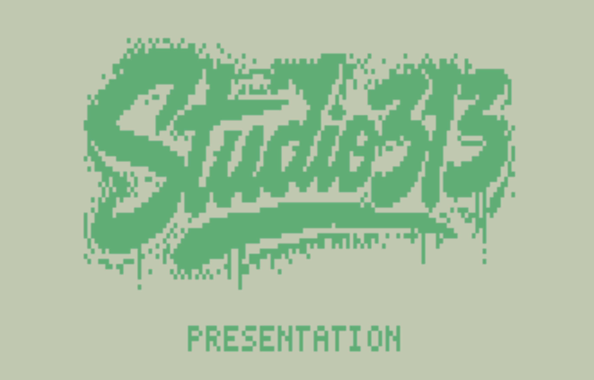
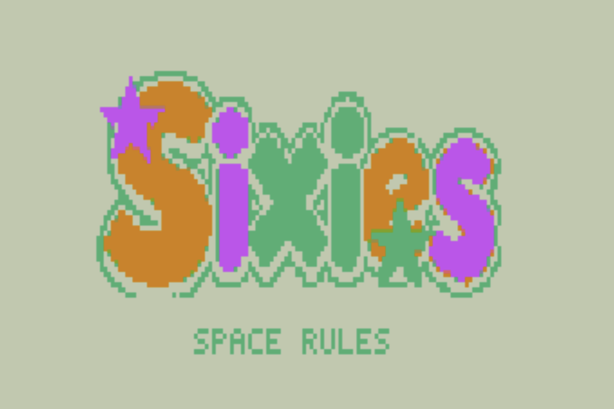

# Sixies for VZ200

Sixies is a dice-merging puzzle game for the VZ200. Place single or double
dice on a 5x5 board, connect three or more matching faces, and make room for
the next piece. This branch is the expanded-RAM VZ200 port, written in Z80
assembly for the Mode 1 128x64 four-color display.

## Screenshots

| Presentation | Rules |
| --- | --- |
|  |  |

| Gameplay | High scores |
| --- | --- |
|  |  |


## Requirements

- A VZ200 with the 16 KB RAM expansion and optional joystick interface, or
  MAME configured as `vz200 -mem laser210_16k -io joystick`.
- VZ200 MAME ROMs placed in `.tools/mame/roms/vz200`. ROMs are not included
  in the repository.
- `sjasmplus`, MAME, and `ffmpeg`. The setup target installs missing tools
  where possible.

Sixies checks for the expanded RAM at boot and shows a clear warning if the
module is absent. The 16 KB target is required for the pre-rendered artwork,
attract screens, and current code layout.

## Build And Run

```sh
make setup-vz200-dev
make vz200
make run-vz200
```

The build assembles `ports/vz200/asm/sixies.asm`, generates VZ display data
from source PNG artwork, and writes these artifacts:

```text
build/vz200/sixies-vz200.bin
build/vz200/SIXIES.VZ
```

`make run-vz200` launches `SIXIES.VZ` in MAME with the VZ joystick interface
enabled. The launcher records MAME output in `.context/mame-vz200.log` and
the process ID in `.context/mame-vz200.pid`.

## Controls

The attract loop rotates through the presentation, title, high-score, and
credits screens. Press `Space` or `Return` for the bordered rules card, then
press any key to start a game. `N` starts a new game directly from an attract
screen.

- `W`, `A`, `S`, `D`: move the placement cursor.
- `Q` or `E`: rotate a double die.
- `Space` or `Return`: place the current die or double.
- `N`: start a new game.
- `.`: development shortcut that fills the board and starts the game-over
  sequence.
- Left VZ joystick: stick to move, `FIRE` to place, and `ARM` to rotate.

The startup page reports joystick detection after it observes a joystick input.
The original interface has no idle presence signal, so an untouched module and
an empty slot are electrically indistinguishable.

## Rules

Each turn supplies one or two dice. Put them onto empty cells of the 5x5 grid.
When a placement creates an orthogonally connected group of three or more dice
with the same face, the group merges at the active cell into the next face.
Groups of sixes disappear. Chain reactions resolve at that same cell, and a
game ends once no legal placement remains.

The exact cross-platform game contract is documented in
[docs/game-rules.md](docs/game-rules.md). The VZ implementation is the current
hardware-facing presentation port while the shared portable-rules boundary is
developed separately.

When a score enters the top five, choose three initials before it is saved:
`W`/`S` changes the letter, `A`/`D` changes the selected position, and
`Space` or joystick `FIRE` confirms it. High scores remain in RAM until the
program is reloaded.

## Presentation And Sound

The VZ200 version includes presentation, title, instructions, high scores,
credits, and game-over screens. The instruction card covers 5x5 placement,
rotation, matching three or more dice, chain scoring, and sixes clearing
space. Merge words appear in the sidebar while play continues, and the title
stars twinkle during the attract cycle.

The VZ has a latch-driven one-bit speaker, not a C64 SID. Its square-wave
effects recreate the C64 gameplay cues in VZ form: cursor bounce,
placement/rotation ping, denied-placement bonk, new-game sweep, ascending
merge arpeggios, and the descending six-clear burst. Audio never consumes the
deterministic rules RNG.

## Project Layout

- `ports/vz200/asm/sixies.asm`: Z80 game, graphics, input, and speaker code.
- `ports/vz200/assets/`: source artwork for VZ screens and title stars.
- `scripts/convert-vz200-*.py`: build-time VZ artwork converters.
- `docs/porting-vz200.md`: porting decisions, memory plan, and next milestones.
- `tests/porting/`: platform-neutral gameplay conformance vectors.

Run `make test-porting` to validate the shared gameplay contract. The full
VZ-specific guide is also available at
[ports/vz200/README.md](ports/vz200/README.md).
