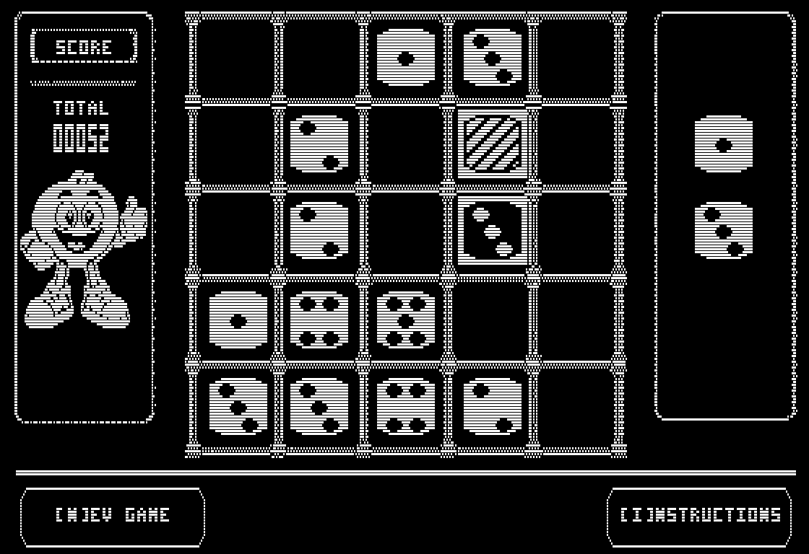

# SIXIES for Apple II

SIXIES is a native Apple II port of the repository's C64 dice-merging puzzle game. Place single or paired dice on a 5x5 board, connect three or more equal values, and create chain reactions while keeping space available.

The port is written in C and 6502 assembly with cc65. Its Studio313 presentation card, title, board, dice, mascot, score display, merge fireworks, and comic callouts use monochrome Apple II double-hi-resolution graphics. Generated binaries and downloaded tools are intentionally excluded from Git; the documented build recreates the complete bootable disk from source.



*Current gameplay captured directly from izapple2's emulated framebuffer.*

## Apple II Specifications

| Component | Requirement |
| --- | --- |
| Machine | Enhanced Apple IIe or compatible emulator |
| Memory | 128 KB with auxiliary memory |
| CPU | 6502-compatible; tested with the enhanced Apple IIe model |
| Display | 80-column-capable DHGR, 560x192 monochrome |
| Video page | DHGR Page 1 in main and auxiliary RAM |
| Storage | Bootable ProDOS-order `.po` disk image |
| Operating system | ProDOS 2.4.3 disk template |
| Input | Apple II keyboard |
| Source language | C and 6502 assembly, compiled by cc65 |
| Program address | `$4000`, with high memory limited to `$BF00` |
| Software stack | `$0300` bytes |
| Language card | Merge sprite and score rendering code at `$D400` |

The supplied launcher uses an enhanced Apple IIe with RGB output and empty slots 2, 3, and 4. The RGB setting displays the one-bit DHGR art as stable black and white rather than composite artifact colors.

## Game Features

- A 5x5 pre-rendered DHGR grid that remains in place during movement and placement.
- A timed monochrome DHGR attract loop with Studio313 presentation, title, and instruction screens.
- The initial title remains for ten seconds; subsequent attract screens rotate every five seconds.
- Random single or paired dice, with four-way rotation for pairs.
- Occupied targets shown with per-die diagonal hatching.
- Three-or-more edge-connected dice merge into the next value.
- Connected sixes are removed from the board.
- Chain reactions resolve one merge at a time so every board change remains visible.
- The current and next placement dice appear in the right panel.
- The mascot and persistent five-digit score appear in the left panel.
- Multiple merges resolve as separate visual events with an immediate score update for each one.
- Grid ripples, flashing merged dice, falling star sprites, and comic callouts accompany merges.
- `FIVES` is reserved for value-5 merges and `SIXIES` for value-6 merges.
- Single-die mode begins when no adjacent empty pair remains.
- Filling the final empty cell ends the game.

## Scoring

A merge awards the face value multiplied by the number of consumed dice. Three ones score 3 points, three twos score 6, three fives score 15, and larger connected groups score all consumed dice.

Removing sixes adds a 50-point bonus. A merge of three sixes therefore scores `3 x 6 + 50 = 68` points. In a chain reaction, each merge redraws its result, updates the scoreboard, and completes its ripple, star burst, and callout before the next merge begins.

## Host Requirements

The automated setup currently targets macOS on Apple silicon or Intel. Internet access is required the first time it downloads tools and the ProDOS template.

To play an already-built `sixies.po`, no compiler or asset tools are required. You only need an enhanced Apple IIe emulator configured as described in the [Emulator](#emulator) section. A source checkout does not include generated build products, so building the disk from GitHub requires the tools below.

Install these host prerequisites before running the setup:

| Host tool | Purpose |
| --- | --- |
| Git | Clone and update the repository |
| GNU Make | Run the build targets |
| Python 3 with `venv` | Run asset generators and tests |
| Homebrew | Install cc65 and OpenJDK when missing |
| `curl`, `tar`, and `shasum` | Download and verify workspace tools |

Homebrew can be installed from [brew.sh](https://brew.sh/). On a new Mac, the Xcode command-line tools provide Git and Make:

```sh
xcode-select --install
```

## Quick Start from GitHub

Clone the repository and run all commands from its root directory:

```sh
git clone https://github.com/SkiltonUSA/Sixies_Development.git
cd Sixies_Development
make -C apple2 setup-tools
make -C apple2 doctor
make -C apple2 run
```

`setup-tools` installs or downloads the development environment. `doctor` builds the program and verifies the emulator configuration. `run` creates the disk image, copies it to a disposable emulator directory, and boots SIXIES.

Windows and Linux setup is not currently automated. On those hosts, install cc65, Python 3 with Pillow, Java, AppleCommander, a ProDOS disk template, and a compatible Apple II emulator manually before using the Makefile as a reference.

## Installed Tools

The setup script keeps downloaded dependencies under the ignored `.tools/` directory so they do not modify the repository or need to be committed.

| Tool | Installation | Purpose |
| --- | --- | --- |
| cc65 / `cl65` | Homebrew when absent | Compile C and 6502 assembly for the Apple II |
| Python virtual environment | `.tools/apple2-venv` | Isolate asset-generation packages |
| Pillow | Installed in the virtual environment | Convert and validate source artwork |
| AppleCommander | `.tools/applecommander` | Create and populate the ProDOS disk image |
| izapple2 2.4.0 | `.tools/izapple2` | Run the enhanced Apple IIe emulator |
| ProDOS 2.4.3 template | `.tools/apple2-prodos` | Supply the bootable disk filesystem |
| OpenJDK | Homebrew when absent | Run AppleCommander |

izapple2 and the ProDOS template are checksum-verified by `scripts/setup-tools.sh`. AppleCommander is downloaded from its current GitHub release.

## Build Commands

Run these commands from the repository root:

| Command | Result |
| --- | --- |
| `make -C apple2 setup-tools` | Install and verify required tools |
| `make -C apple2` | Compile the `SIXIES` Apple II binary |
| `make -C apple2 assets` | Regenerate graphics, sprites, and previews |
| `make -C apple2 test` | Run the Python asset and renderer tests |
| `make -C apple2 disk` | Build the bootable `sixies.po` image |
| `make -C apple2 run` | Build and boot the game in izapple2 |
| `make -C apple2 debug` | Boot with ProDOS MLI tracing in the terminal |
| `make -C apple2 doctor` | Build and verify the complete environment |
| `make -C apple2 clean` | Remove generated Apple II build files |

The principal generated files are:

| Path | Description |
| --- | --- |
| `apple2/build/SIXIES` | Native Apple II executable |
| `apple2/build/sixies.po` | Bootable ProDOS-order disk image |
| `apple2/build/sixies.map` | cc65 linker memory map |
| `apple2/build/assets/` | Runtime DHGR pages, dice, stars, and callouts |
| `apple2/build/generated/` | Generated C headers for asset geometry |
| `apple2/build/previews/` | PNG previews of converted Apple II artwork |

The disk contains `SIXIES.SYSTEM`, `SIXIES`, compressed `PRESENTS.RLE`, `INSTRUCT.RLE`, and `GAMEOVER.RLE` screens, the original `TITLE.A2FM`, `GRID.A2FM`, `DICE.BLITS`, `MERGESTAR`, and the ten `FX00` through `FX09` callout files. Booting the disk launches `SIXIES.SYSTEM`, which loads the game.

## Emulator

`make -C apple2 run` launches the workspace copy of izapple2 with the equivalent configuration:

```sh
.tools/izapple2/izapple2 \
  -model=2enh \
  -rgb \
  -s2=empty \
  -s3=empty \
  -s4=empty \
  apple2/build/sixies.po
```

The launcher first copies the packaged disk to `apple2/build/emulator/sixies-run.po`. Emulator writes therefore do not modify `apple2/build/sixies.po`.

To use another Apple II emulator, configure an enhanced Apple IIe with 128 KB RAM, auxiliary memory, 80-column/DHGR support, and the `.po` image in drive 1. RGB or monochrome output is recommended. Boot the disk and run `SIXIES.SYSTEM` if the emulator does not launch it automatically.

izapple2 shortcuts used during development:

| Key | Emulator action |
| --- | --- |
| `F1` | Show emulator help |
| `F4` | Toggle CPU tracing |
| `F5` | Toggle full-speed execution |
| `F6` | Cycle display modes |
| `F12` | Save `snapshot.png` |

## Controls

| Key | Game action |
| --- | --- |
| Arrow keys or `W`, `A`, `S`, `D` | Move the placement dice |
| `R` or `Q` | Rotate a paired piece |
| `Space` or `Return` | Place the current piece |
| `N` | Clear the board and start a new game |

## Graphics and Runtime Design

Static full-screen graphics are stored as disk-backed DHGR pages. The game streams main and auxiliary banks into Page 1, then updates only dirty cell interiors. Dice and score digits use fixed-position opaque or XOR assembly blits, while moving star effects use pre-shifted XOR sprites that restore the pixels beneath them.

The Studio313 intro, generated instruction page, and game-over screen are RLE-packed so the new page fits the 140 KB ProDOS disk while the supplied title retains its faster raw A2FM loader. The title and grid share a single-open A2FM streamer; the compressed-screen loader reads one bank at a time into the reusable dice buffer and expands it through the 1 KB transfer buffer. Startup shows the presentation for five seconds and the initial title for ten seconds, then rotates instructions, presentation, and title at five seconds each. `Space`, `Return`, or `N` starts immediately from any attract screen; the normal dice load then reuses the same memory.

`generate_score_digits.py` precomputes the auxiliary/main masks for all eight possible 3-bit glyph rows at each of the five fixed score positions. A score change compares the old and new five-digit values and blits only changed positions, so gameplay performs no sprite construction, alignment division, or modulo operations.

Opaque merge callouts save their covered main/auxiliary Page 1 rectangle into unused auxiliary HGR Page 2. A language-card assembly copy restores those 1,920 bytes immediately after the flash, avoiding the former 16 KB grid reload and complete scene redraw.

The executable begins at `$4000`, so HGR Page 2 is not available for page flipping. Low-frequency game logic remains in C; auxiliary-memory copies and rendering loops are implemented in 6502 assembly. The `$0300` software stack preserves enough heap for repeated ProDOS asset reads.

More implementation detail is available in [Apple II implementation notes](docs/apple2-implementation-notes.md).

## Troubleshooting

### `cl65 was not found on PATH`

Install cc65 and rerun setup:

```sh
brew install cc65
make -C apple2 setup-tools
```

### Python cannot create the virtual environment

Install a current Python and rerun setup:

```sh
brew install python
make -C apple2 setup-tools
```

### AppleCommander reports that Java is missing

Install OpenJDK. If Java is in a nonstandard location, pass it to the disk build explicitly:

```sh
brew install openjdk
JAVA_BIN="$(brew --prefix openjdk)/bin/java" make -C apple2 disk
```

### The emulator shows the wrong colors or no DHGR screen

Use the enhanced Apple IIe model with 128 KB, auxiliary memory, and 80-column support. With izapple2, use `make -C apple2 run` so the required `-model=2enh` and `-rgb` options are applied.

### Generated graphics or the disk appear stale

Remove the build directory and recreate every asset:

```sh
make -C apple2 clean
make -C apple2 test
make -C apple2 disk
```

### Verify the complete installation

```sh
make -C apple2 doctor
```

The doctor target reports the compiler, disk image, and emulator configuration, and exits on a missing dependency or failed build step.
