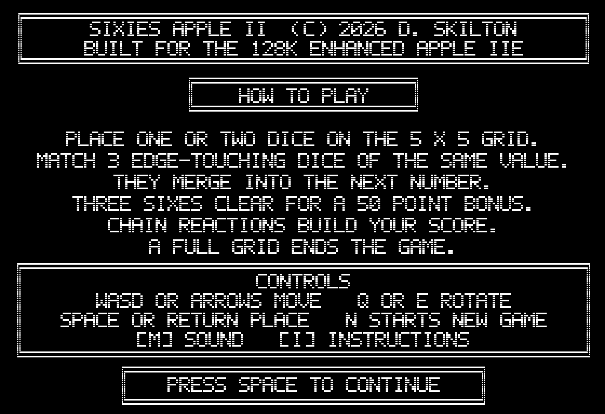

# SIXIES for Apple II

SIXIES is a native Apple II port of the repository's C64 dice-merging puzzle game. Place single or paired dice on a 5x5 board, connect three or more equal values, and create chain reactions while keeping space available.

The port is written in C and 6502 assembly with cc65. Its Studio313 presentation card, title, board, dice, mascot, score display, merge fireworks, and comic callouts use monochrome Apple II double-hi-resolution graphics. Generated binaries and downloaded tools are intentionally excluded from Git; the documented build recreates the complete bootable disk from source.

## Screenshots

### Gameplay


*Current gameplay captured directly from izapple2. The placement die is shown with collision hatching; `[N]EW GAME` and `[I]NSTRUCTIONS` use matching footer controls.*

### Instructions



*Press `I` during a game to open this page. Press `Space` to reconstruct and return to the unchanged board.*

## Apple II Specifications

| Component | Requirement |
| --- | --- |
| Machine | Enhanced Apple IIe or a compatible emulator |
| CPU | 65C02 at the standard Apple II rate, approximately 1.023 MHz |
| Memory | 128 KB total: 64 KB main RAM and 64 KB auxiliary RAM |
| Auxiliary hardware | Extended 80-column memory support required for DHGR |
| Display | Double-hi-resolution, 560x192 one-bit monochrome |
| Video page | DHGR Page 1 in main and auxiliary RAM |
| Storage | One 140 KB ProDOS-order `.po` disk image in drive 1 |
| Operating system | ProDOS 2.4.3 disk template |
| Input | Apple II keyboard |
| Sound | Built-in one-bit Apple II speaker; no Mockingboard required |
| Source language | C and 6502 assembly, compiled by cc65 |
| Program address | Exomizer SFX at `$080D`; game unpacked to `$4000`, with high memory limited to `$BF00` |
| Software stack | `$0300` bytes |
| Language card | Merge sprite and score rendering code at `$D400` |

The supplied launcher selects izapple2's enhanced Apple IIe model, which uses a 65C02 and the required auxiliary memory. It enables RGB output and leaves slots 2, 3, and 4 empty. RGB displays the one-bit DHGR art as stable black and white rather than composite artifact colors. A joystick, mouse, Mockingboard, accelerator, and hard disk are not required.

## Game Features

- A 5x5 pre-rendered DHGR grid that remains in place during movement and placement.
- A timed attract loop with Studio313 presentation, title, instructions, and the live ten-entry high-score table.
- The initial title remains for ten seconds; subsequent attract screens rotate every five seconds.
- Random single or paired dice, with four-way rotation for pairs. During normal play, pairs occur on two-thirds of turns and singles on one-third. Values 1, 2, and 3 may appear alone. Allowed pairs are `1+2`, `1+3`, `2+3`, `2+4`, `3+3`, and `3+4`. A standalone 4 unlocks when three value-4 dice are on the board; a standalone 5 unlocks when four value-5 dice are on the board. Value 5 never appears in a pair.
- The board-placement dice invert while waiting for input, without flashing the current-dice sidebar.
- Occupied targets shown with per-die diagonal hatching.
- Stock-speaker effects reproduce the C64 movement bounce, rotation/placement portal ping, descending invalid-placement bonk, value-specific merge arpeggios, and sixes noise burst. `M` toggles them on or off.
- Three-or-more edge-connected dice merge into the next value.
- Connected sixes are removed from the board.
- Chain reactions resolve one merge at a time so every board change remains visible.
- Only the current placement dice appear centered in the right panel; labels and the next-piece preview are omitted to conserve memory.
- The mascot and persistent five-digit score appear in the left panel.
- Multiple merges resolve as separate visual events with an immediate score update for each one.
- Horizontal and vertical grid ripples accompany every merge; merges consuming fives or sixes add four simultaneous diagonal arms. Flashing merged dice, falling star sprites, comic callouts, and value-specific sounds complete the effect.
- Merges of exactly three fives or exactly three sixes shake the grid horizontally.
- `FIVES` appears when fours merge into a five, and `SIXIES` when fives merge into a six.
- `AWESOME` is reserved for the second and later generic merges in the same placement turn.
- Forced single-die mode applies only while no adjacent empty pair remains. After 5s and 6s clear and open pair space, normal pair generation resumes.
- In forced single-die mode, two-thirds of generated dice are weighted toward eligible values bordering the remaining empty cells; one-third retain normal random selection.
- Filling the final empty cell ends the game.
- A compact ten-entry DHGR high-score table records three initials and a five-digit score on disk, with the supplied lucky-dice artwork in its right panel.
- Pressing `N` during gameplay asks `ARE YOU SURE [Y/N]?`; only `Y` clears the current board.
- The lower-right `[I]NSTRUCTIONS` button mirrors `[N]EW GAME`; pressing `I` opens the instruction page and `Space` returns to the unchanged game.

## Scoring

A merge awards the face value multiplied by the number of consumed dice. Three ones score 3 points, three twos score 6, three fives score 15, and larger connected groups score all consumed dice.

Removing sixes adds a 50-point bonus. A merge of three sixes therefore scores `3 x 6 + 50 = 68` points. In a chain reaction, each merge redraws its result, updates the scoreboard, and completes its ripple, star burst, and callout before the next merge begins.

At game over, `Space`, `Return`, or `N` opens the high-score table. A qualifying score prompts for three letters, inserts the result in descending order, and saves it to the disk's 56-byte `HISCORE` file. The table retains ten entries; a score must exceed at least one existing entry to qualify.

New disks seed the table with `DOM 1349`, `PRI 1020`, `TWD 893`, `TAN 802`, `TB 755`, `ACE 650`, `MAX 540`, `ZED 430`, `BOT 320`, and `CPU 210`. An invisible trailing space pads the two-letter `TB` name to the table's fixed three-character initials field.

## Host Requirements

The automated setup currently targets macOS on Apple silicon or Intel. Internet access is required the first time it downloads tools and the ProDOS template.

To play an already-built `sixies.po`, no compiler or asset tools are required. You only need an enhanced Apple IIe emulator configured as described in the [Emulator](#emulator) section. A source checkout does not include generated build products, so building the disk from GitHub requires the tools below.

Install these host prerequisites before running the setup:

| Host tool | Purpose |
| --- | --- |
| Git | Clone and update the repository |
| GNU Make | Run the build targets |
| Python 3 with `venv` | Run asset generators and tests |
| Homebrew | Install cc65 and OpenJDK when missing |
| `curl`, `tar`, and `shasum` | Download and verify workspace tools |

Homebrew can be installed from [brew.sh](https://brew.sh/). On a new Mac, the Xcode command-line tools provide Git and Make:

```sh
xcode-select --install
```

## Quick Start from GitHub

The automated path supports macOS on Apple silicon and Intel. Clone the repository and run all commands from its root directory:

```sh
git clone https://github.com/SkiltonUSA/Sixies_Development.git
cd Sixies_Development
make -C apple2 setup-tools
make -C apple2 test
make -C apple2 doctor
make -C apple2 run
```

`setup-tools` installs or downloads the development environment. `test` verifies the asset converters and gameplay source contracts. `doctor` builds the assets and release disk and verifies the emulator configuration. `run` refreshes the emulator working copy while preserving its saved high scores, then boots SIXIES.

To play:

1. Wait for the attract sequence, or press `Space`, `Return`, or `N` to start immediately.
2. Move with the arrow keys or `W`, `A`, `S`, and `D`; rotate paired dice with `E` or `Q`.
3. Place dice with `Space` or `Return`.
4. Press `I` to read the instructions during play, then press `Space` to return to the same game.
5. Close the izapple2 window or press `Command-Q` when finished. High scores saved to the emulator disk are retained on the next `make -C apple2 run`.

Windows and Linux setup is not currently automated. On those hosts, install cc65, Exomizer 3.1.2, Python 3 with Pillow, Java, AppleCommander, a ProDOS disk template, and a compatible Apple II emulator manually before using the Makefile as a reference.

## Development Tools

The setup script keeps downloaded dependencies under the ignored `.tools/` directory so they do not modify the repository or need to be committed.

| Tool | Installation | Purpose |
| --- | --- | --- |
| cc65 / `cl65` | Homebrew when absent | Compile C and 6502 assembly for the Apple II |
| Exomizer 3.1.2 | Homebrew when absent | Build and verify the Apple II self-extracting executable |
| Python virtual environment | `.tools/apple2-venv` | Isolate asset-generation packages |
| Pillow | Installed in the virtual environment | Convert and validate source artwork |
| AppleCommander | `.tools/applecommander` | Create and populate the ProDOS disk image |
| izapple2 2.4.0 | `.tools/izapple2` | Run the enhanced Apple IIe emulator |
| ProDOS 2.4.3 template | `.tools/apple2-prodos` | Supply the bootable disk filesystem |
| OpenJDK | Homebrew when absent | Run AppleCommander |

izapple2 and the ProDOS template are checksum-verified by `scripts/setup-tools.sh`. AppleCommander is downloaded from its current GitHub release.

## Python Asset Pipeline

All Python tools run through `.tools/apple2-venv/bin/python`; Pillow is their only third-party Python dependency. `make -C apple2 assets` runs the production generators in dependency order and writes disposable output under `apple2/build/`. Source artwork remains under `apple2/assets/` or the repository's shared `src/assets/` directory.

| Script | Build responsibility |
| --- | --- |
| `import_a2fm_asset.py` | Splits b2d `.a2fm` files into validated 8 KB auxiliary and main DHGR banks and creates monochrome previews. |
| `import_a2fm_grid.py` | Imports the supplied gameplay grid, clears dynamic regions, adds the mascot and matching footer controls, validates all 25 die interiors, and emits `GRID.A2FM`. |
| `generate_hgr_dice.py` | Converts the six source dice into phase-correct fixed-position DHGR blits, collision hatching, edge-restore data, and generated C geometry. |
| `generate_title.py` | Adds the start prompt to the supplied title A2FM page without changing the title artwork. |
| `generate_presents.py` | Converts and RLE-packs the monochrome Studio313 presentation screen. |
| `generate_instructions.py` | Pre-renders the complete DHGR rules and controls page, including the in-game `I` and `Space` flow. |
| `generate_game_over.py` | Converts the supplied mascot artwork into the monochrome RLE game-over page. |
| `generate_high_score_screen.py` | Builds the high-score background, mascot/dice art, and the disk-backed DHGR font used for live score rows. |
| `generate_high_scores.py` | Creates the checksummed 56-byte default ten-entry `HISCORE` data file. |
| `generate_merge_effects.py` | Converts the ten exclamation masters and star artwork into compact opaque/XOR DHGR fragments. |
| `generate_score_digits.py` | Emits fixed-position auxiliary/main score masks as a ca65 include, removing runtime font calculations. |
| `generate_footer_prompt.py` | Emits the XOR masks and HGR row addresses for `ARE YOU SURE [Y/N]?`. |
| `pack_dhgr_banks.py` | RLE-packs existing auxiliary/main DHGR banks for the streaming screen loader. |
| `crunch_apple2_binary.py` | Converts the cc65 AppleSingle output for Exomizer 3.1.2, verifies a complete decrunch round trip, and emits the ProDOS-loadable SFX payload. |
| `convert_dhgr_asset.py` / `convert_hgr_asset.py` | Standalone conversion utilities for importing and previewing additional DHGR or HGR artwork. |
| `generate_hgr_grid.py` | Retained HGR grid-conversion reference and geometry test utility; the production grid uses `import_a2fm_grid.py`. |

The shell scripts complete the host workflow: `setup-tools.sh` installs dependencies, `package_disk.sh` copies the executable and generated assets onto the ProDOS image, and `run-emulator.sh` maintains the writable emulator disk and launches izapple2.

## Build Commands

Run these commands from the repository root:

| Command | Result |
| --- | --- |
| `make -C apple2 setup-tools` | Install and verify required tools |
| `make -C apple2` | Compile the `SIXIES` Apple II binary |
| `make -C apple2 crunch` | Create the verified Exomizer release payload |
| `make -C apple2 assets` | Regenerate graphics, sprites, and previews |
| `make -C apple2 test` | Run the Python asset and renderer tests |
| `make -C apple2 disk` | Build the bootable `sixies.po` image |
| `make -C apple2 run` | Build and boot the game in izapple2 |
| `make -C apple2 debug` | Boot with ProDOS MLI tracing in the terminal |
| `make -C apple2 doctor` | Build and verify the complete environment |
| `make -C apple2 clean` | Remove generated Apple II build files |

The principal generated files are:

| Path | Description |
| --- | --- |
| `apple2/build/SIXIES` | Native cc65 Apple II executable and debug input |
| `apple2/build/SIXIES.EXO` | Verified Exomizer SFX machine-code payload |
| `apple2/build/sixies.po` | Bootable ProDOS-order disk image |
| `apple2/build/sixies.map` | cc65 linker memory map |
| `apple2/build/assets/` | Runtime DHGR pages, dice, stars, and callouts |
| `apple2/build/generated/` | Generated C headers for asset geometry |
| `apple2/build/previews/` | PNG previews of converted Apple II artwork |

The disk contains `SIXIES.SYSTEM`, the crunched `SIXIES` ProDOS BIN, compressed `PRESENTS.RLE`, `INSTRUCT.RLE`, `GAMEOVER.RLE`, and `HISCORES.RLE` screens, the prompt-enhanced `TITLE.A2FM`, the disk-backed `HSFONT`, `GRID.A2FM`, `DICE.BLITS`, `MERGESTAR`, the 56-byte `HISCORE` table, and the ten `FX00` through `FX09` callout files. Booting the disk launches `SIXIES.SYSTEM`, which loads the SFX at `$080D`; it decrunches and starts the game at `$4000`.

## Emulator

The recommended launch command is:

```sh
make -C apple2 run
```

It builds `apple2/build/sixies.po`, copies it to the writable `apple2/build/emulator/sixies-run.po`, restores the previous emulator disk's `HISCORE` file, and launches izapple2 with this equivalent configuration:

```sh
.tools/izapple2/izapple2 \
  -model=2enh \
  -rgb \
  -s2=empty \
  -s3=empty \
  -s4=empty \
  apple2/build/emulator/sixies-run.po
```

Emulator writes therefore do not modify the clean release image. Before refreshing the working copy on a later run, the launcher extracts and restores its high-score file.

To use another Apple II emulator:

1. Select an enhanced Apple IIe with a 65C02 and 128 KB RAM.
2. Enable the extended 80-column/auxiliary-memory hardware and DHGR support.
3. Insert `apple2/build/sixies.po` into drive 1 and boot it as a ProDOS-order disk.
4. Choose RGB or monochrome output for stable black-and-white graphics.
5. Run `SIXIES.SYSTEM` if the emulator does not execute the startup file automatically.

izapple2 shortcuts used during development:

| Key | Emulator action |
| --- | --- |
| `F1` | Show emulator help |
| `F4` | Toggle CPU tracing |
| `F5` | Toggle full-speed execution |
| `F6` | Cycle display modes |
| `F12` | Save `snapshot.png` |

## Controls

| Key | Game action |
| --- | --- |
| Arrow keys or `W`, `A`, `S`, `D` | Move the placement dice |
| `E` or `Q` | Rotate a paired piece |
| `Space` or `Return` | Place the current piece |
| `N` | Open the new-game confirmation prompt |
| `M` | Toggle speaker sound on or off |
| `I` | Show instructions; `Space` returns to the current game |
| `Y` / `N` | Confirm a new game / return to the current game |
| `A` through `Z` | Enter three initials after a qualifying game |

## Graphics and Runtime Design

Static full-screen graphics are stored as disk-backed DHGR pages. The game streams main and auxiliary banks into Page 1, then updates only dirty cell interiors. Dice and score digits use fixed-position opaque or XOR assembly blits, while moving star effects use pre-shifted XOR sprites that restore the pixels beneath them.

High scores occupy 56 disk bytes: a four-byte signature, version, checksum, and ten five-byte records containing three initials plus a little-endian 16-bit score. The runtime overlays this data on the existing 1 KB DHGR transfer buffer after the game-over artwork is loaded, avoiding a dedicated high-score BSS allocation. The score page streams a compressed DHGR background with the lucky-dice image, then draws the live entries with a 560-byte disk-backed dual-bank font held in the otherwise reusable dice buffer.

The release disk uses Exomizer 3.1.2's Apple II/IIe SFX target. `crunch_apple2_binary.py` validates cc65's AppleSingle metadata, converts the `$4000` data fork to PRG input, runs `sfx -t162`, verifies a complete `desfx` round trip, validates the generated BASIC launcher, and strips that launcher before ProDOS packaging at its `$080D` machine entry. Decompression does not change the game's runtime memory map.

The Studio313 intro, generated instruction page, and game-over screen are RLE-packed so the new page fits the 140 KB ProDOS disk while the supplied title retains its faster raw A2FM loader. The title and grid share a single-open A2FM streamer; the compressed-screen loader reads one bank at a time into the reusable dice buffer and expands it through the 1 KB transfer buffer. Startup shows the presentation for five seconds and the initial title for ten seconds, then rotates instructions, the live high-score table, presentation, and title at five seconds each. `Space`, `Return`, or `N` starts immediately from any attract screen; the normal dice load then reuses the same memory.

`generate_score_digits.py` precomputes the auxiliary/main masks for all eight possible 3-bit glyph rows at each of the five fixed score positions. A score change compares the old and new five-digit values and blits only changed positions, so gameplay performs no sprite construction, alignment division, or modulo operations.

Opaque merge callouts save their covered main/auxiliary Page 1 rectangle into unused auxiliary HGR Page 2. A language-card assembly copy restores those 1,920 bytes immediately after the flash, avoiding the former 16 KB grid reload and complete scene redraw.

The executable begins at `$4000`, so HGR Page 2 is not available for page flipping. Low-frequency game logic remains in C; auxiliary-memory copies and rendering loops are implemented in 6502 assembly. The `$0300` software stack preserves enough heap for repeated ProDOS asset reads.

More implementation detail is available in [Apple II implementation notes](docs/apple2-implementation-notes.md).

## Troubleshooting

### `cl65 was not found on PATH`

Install cc65 and rerun setup:

```sh
brew install cc65
make -C apple2 setup-tools
```

### Python cannot create the virtual environment

Install a current Python and rerun setup:

```sh
brew install python
make -C apple2 setup-tools
```

### AppleCommander reports that Java is missing

Install OpenJDK. If Java is in a nonstandard location, pass it to the disk build explicitly:

```sh
brew install openjdk
JAVA_BIN="$(brew --prefix openjdk)/bin/java" make -C apple2 disk
```

### The emulator shows the wrong colors or no DHGR screen

Use the enhanced Apple IIe model with 128 KB, auxiliary memory, and 80-column support. With izapple2, use `make -C apple2 run` so the required `-model=2enh` and `-rgb` options are applied.

### Generated graphics or the disk appear stale

Remove the build directory and recreate every asset:

```sh
make -C apple2 clean
make -C apple2 test
make -C apple2 disk
```

### Verify the complete installation

```sh
make -C apple2 doctor
```

The doctor target reports the compiler, disk image, and emulator configuration, and exits on a missing dependency or failed build step.
