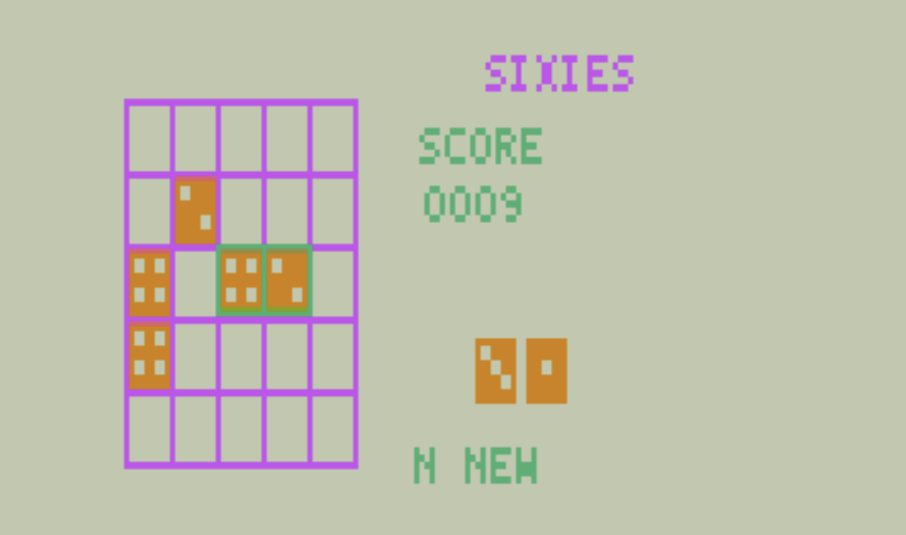
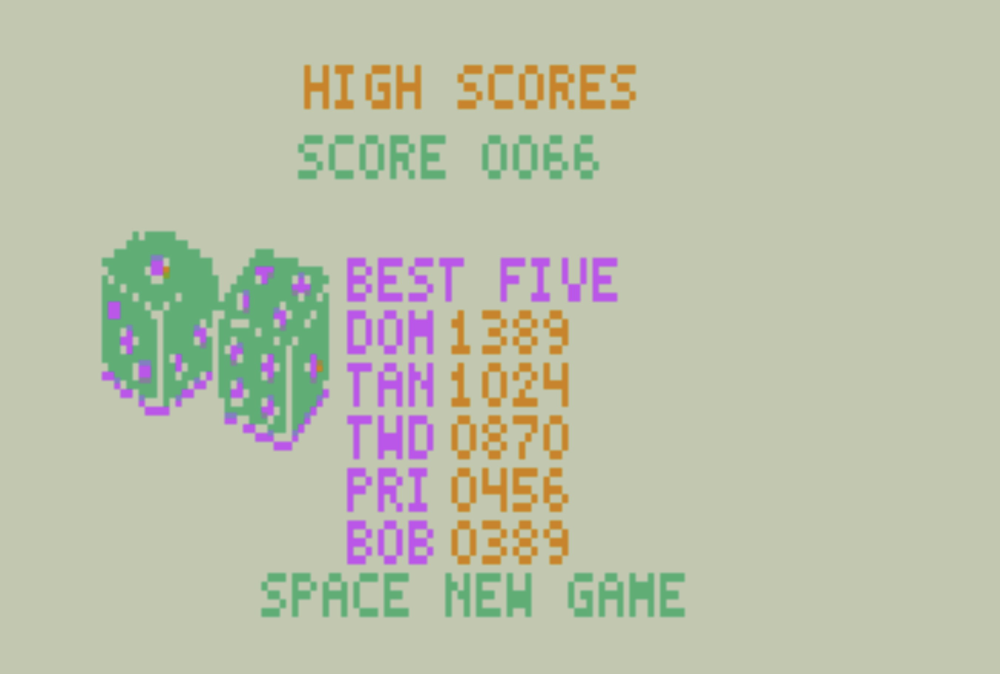
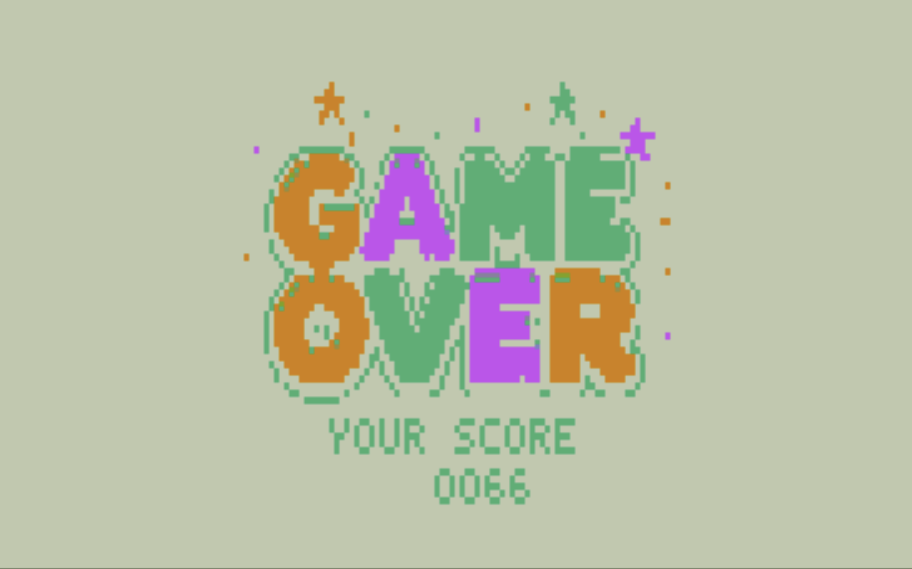

# Sixies for VZ200

Sixies is a 5x5 dice-merging puzzle game for a VZ200 with the 16 KB RAM
expansion. This port is written in Z80 assembly and uses the VZ Mode 1
128x64 four-color display. It is a playable presentation prototype while the
shared portable rules-engine work remains in progress.

## Screenshots

| Gameplay | High scores |
| --- | --- |
|  |  |



## Requirements

- VZ200 or MAME configured as `vz200 -mem laser210_16k`.
- The VZ 16 KB RAM module is required. Startup verifies the expansion and
  reports an on-screen error when it is unavailable.
- `sjasmplus`, MAME, and `ffmpeg` for the local asset pipeline. The setup
  target installs missing tools under `.tools/` where possible.
- MAME VZ200 ROMs in `.tools/mame/roms/vz200`. They are not distributed with
  this repository.

## Build And Run

```sh
make setup-vz200-dev
make vz200
make run-vz200
```

`make vz200` assembles `ports/vz200/asm/sixies.asm`, generates the required
VZ screen data from the source PNG assets, and writes:

```text
build/vz200/sixies-vz200.bin
build/vz200/SIXIES.VZ
```

`make run-vz200` launches the snapshot in MAME with the 16 KB configuration.
MAME output is recorded in `.context/mame-vz200.log` and its process ID in
`.context/mame-vz200.pid`.

## Play

The attract loop rotates through presentation, title, and high-score pages.
Press `Space` or `Return` to open the rules page, then press a key to begin.

- `W`, `A`, `S`, `D`: move the placement cursor.
- `Q` or `R`: rotate a double die.
- `Space` or `Return`: place the current die or double.
- `N`: start a new game.
- `.`: development shortcut that fills the board and enters the game-over
  flow.

Place one or two dice on the 5x5 board. Three or more orthogonally connected
dice with the same face merge into the next face; groups of sixes disappear.
The game ends when no legal placement remains. Full rules and conformance
vectors are in [docs/game-rules.md](../../docs/game-rules.md).

## Presentation And Audio

The port includes presentation, title, instruction, game-over, and high-score
screens. After a merge, a clean text callout occupies the sidebar briefly while
gameplay continues. The Mode 1 palette is shared by the full screen, so die
faces and pips remain the primary identity rather than color alone.

The VZ200 has a latch-driven one-bit speaker rather than the C64 SID. The port
therefore translates the C64 effects into square-wave equivalents: cursor
bounce, placement/rotation ping, denied-placement bonk, new-game sweep,
ascending merge arpeggios, and a descending six-clear burst. These effects
never consume the deterministic game RNG.

## Source Layout

- `asm/sixies.asm`: VZ hardware, rendering, input, audio, and current rules
  strawman.
- `assets/`: source PNG masters for title, presentation, game-over, and
  high-score artwork.
- `../../scripts/convert-vz200-*.py`: asset converters used by `make vz200`.
- `../../docs/porting-vz200.md`: platform decisions and the planned shared
  rules-engine boundary.
